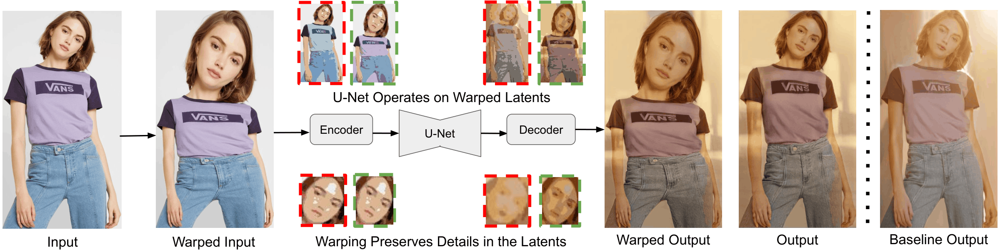

---

<div align="center">

# [ECCV 2026] WarpI2I: <br> Image Warping for Image-to-Image Translation

[Shen Zheng](https://shenzheng2000.github.io/), [Anurag Ghosh](https://anuragxel.github.io/), [Gaurav Parmar](https://gauravparmar.com/), and [Srinivasa Narasimhan](https://www.cs.cmu.edu/~srinivas/)

Carnegie Mellon University

<a href='#'></a>&nbsp;
<a href='https://shenzheng2000.github.io/WarpI2I.github.io/'></a>&nbsp;


</div>

---

## 🤗 Overview


We warp the input image to enlarge salient regions (e.g., objects, faces, eyes) to better preserve fine details in the compressed latent space during image-to-image translation. In the following figure, original latents are shown in <span style="color: red;">**red**</span>, and warped latents in <span style="color: green;">**green**</span>.
<br>



## 📌 TODO Lists

- [ ] Add demo
- [ ] Add Train & Test code
- [ ] Add arXiv link


## ⭐️ Star History
[](https://star-history.com/#ShenZheng2000/WarpI2I&Date)


## ✍️ Citation

If you find this work useful, please cite:

```bibtex
@inproceedings{zheng2026warpi2i,
  title     = {WarpI2I: Image Warping for Image-to-Image Translation},
  author    = {Zheng, Shen and Ghosh, Anurag and Parmar, Gaurav and Narasimhan, Srinivasa},
  booktitle = {ECCV},
  year      = {2026}
}
```


## 🙏 Acknowledgement

This project builds upon the following excellent open-source works:
- [img2img-turbo](https://github.com/GaParmar/img2img-turbo)
- [Instance-Warp](https://github.com/ShenZheng2000/Instance-Warp)
- [Two-Plane Prior](https://github.com/geometriczoom/two-plane-prior)